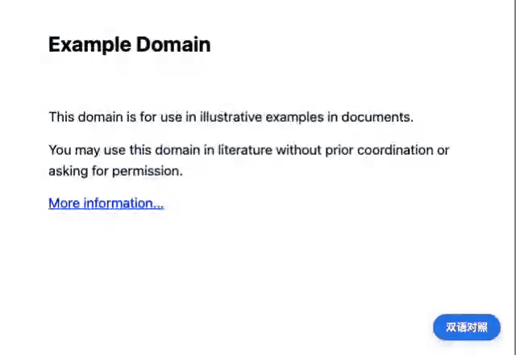
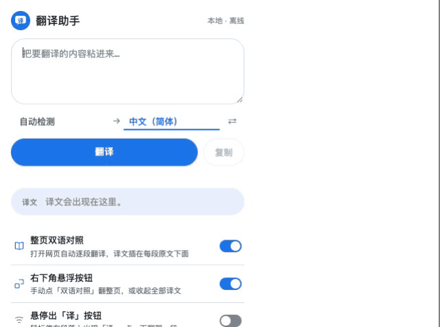
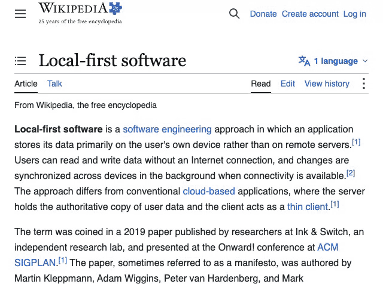
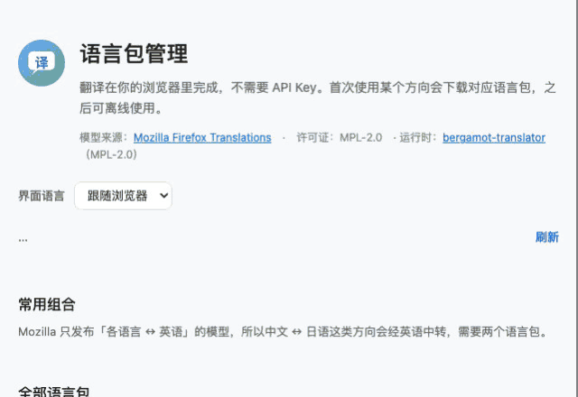

<div align="center">

# Translate Assistant

**Translate foreign-language pages locally in your browser — no API keys, no uploads, offline once packs are installed**

*On-device translation for Chrome: bilingual full-page view, select-to-translate and reply drafts. A Google Translate / Immersive Translate alternative that needs no API key and sends nothing anywhere.*

[简体中文](README.md) | **English README**

[](LICENSE)
[](https://www.google.com/chrome/)
[](https://github.com/DreamOfXM/translate-assistant/pulls)



*Open a foreign page and translations appear under each paragraph — fully local, zero configuration*

</div>

---

## ✨ What it does

| | Feature | Details |
| --- | --- | --- |
| 📖 | **Bilingual page** | Open a foreign page and translations appear under each paragraph. Only the article body — nav, ads and comment sections are never touched |
| 🔍 | **Select to translate** | Select any foreign text, click the floating pill, get a result card in place |
| ✍️ | **Reply assistant** | Draft a reply in your language in any comment box, generate a translation, and it's filled in **only after you confirm** — never auto-posted |
| ⚡ | **Two engines, picked automatically** | Uses the browser's built-in model when it's available (Chrome 138+), otherwise the offline engine bundled with the extension |
| 📴 | **Offline** | Install a language pack once and translation keeps working without a network |
| 🔒 | **Privacy first** | Page text, drafts and translations are never uploaded — both engines translate on your device; the network is only used to download models |

<p align="center">
  
  &nbsp;&nbsp;
  
</p>

## 🌐 Translation engines: both run on your device

Two engines ship with the extension, and it picks whichever fits — either way **your text is never uploaded**.

| | Engine | When it's used |
| --- | --- | --- |
| ⚡ | **Chrome built-in translation**<br>(Chrome 138+) | Preferred whenever the browser already has the on-device model for that language pair. Chrome downloads and manages the model itself; per Chrome's documentation, no data is sent to Google or third parties when the model is used |
| 📦 | **Local language packs**<br>[bergamot-translator](https://github.com/browsermt/bergamot-translator) (same engine Firefox Translations uses, MPL-2.0) | Fallback whenever the above isn't available — and the only option offline, on intranets, or in airplane mode |

> Chrome gates the built-in model download behind a user gesture: it only starts when you click **Translate**, never silently.
> Until the model is ready, that first translation is served by the local language pack while the download continues in the background; later paragraphs switch over automatically.

## 📥 Language packs: install once, offline forever

Models come from Mozilla's public [Firefox Translations](https://github.com/mozilla/firefox-translations-models) catalog (116 directions, MPL-2.0).

<p align="center">
  
</p>

- **On-demand download**: a pack (about 25–50 MB) is fetched the first time you use a direction, with the size shown up front
- **Offline runtime**: once installed, translation is fully local — airplane mode included
- **Integrity checked**: model files are SHA-256 verified; corrupted files are discarded automatically
- **Relay for non-English pairs**: Mozilla only publishes X↔English models, so pairs like Chinese↔Japanese relay through English (the UI tells you when two packs are needed)

## 📦 Install

### Option 1: download a build (recommended)

1. Grab the latest `translate-assistant-vX.Y.Z.zip` from [Releases](https://github.com/DreamOfXM/translate-assistant/releases)
2. Unzip it anywhere
3. Open `chrome://extensions` → enable **Developer mode** → click **Load unpacked** → select the unzipped `translate-assistant` folder
4. Refresh already-open pages (the content script only injects into newly loaded ones)

> Unpacked extensions require developer mode; the extension contains zero telemetry, and the source is all here to audit.

### Option 2: build from source (developers)

Requires Chrome 109+ (offscreen documents API) and Node.js 18+.

```bash
npm install
npm run build
```

The build lands in `dist/translate-assistant` (load it as above) and also produces a distributable `dist/translate-assistant-v<version>.zip`.

> ⚠️ Load `dist/`, never `extension/`: `content.js` must be bundled by esbuild into a single classic script.

## 🚀 Quick start

1. **Install a pack**: click the extension icon → **Manage packs** → download the direction you need (e.g. en→zh)
2. **Read foreign pages**: just open them — translations appear automatically; the floating button collapses everything
3. **Reply in foreign languages**: hit **Translate reply** in a comment box or in a webmail compose box, write in your language, generate, confirm, fill in

The UI speaks **中文 / English** — it follows your browser language and can be switched on the welcome page or in the pack manager.

## 🖥️ macOS menu bar app

> This section is for macOS users only; Windows / Linux users can skip it — the extension itself uses no platform-specific features.

A browser extension can only see the pages it injects into. To translate the input
field of **any app** (Notes, mail clients, chat apps, web pages) on the same engine,
the repo also ships a macOS menu bar app.

```bash
npm run build:macos
open macos/dist/TranslateAssistant.app
```

- `⌃⌥T` translates the focused input field, `⌃⌥Y` translates the selection; confirm in
  the panel and the result is written back in place
- Reuses the **same** Bergamot WASM engine and the same language packs, fully offline
- Reads and writes the focused field through the system Accessibility API, so it needs
  a one-time Accessibility grant
- The panel deliberately never steals focus; focus is handed back to the target app
  before writing

Scope, permission steps and known blind spots: [macos/README.md](macos/README.md).

## ⚠️ Known limitations

- Models are English-centric: non-English pairs relay through English, costing some speed and quality
- The Chrome built-in engine needs Chrome 138+; which language pairs it covers is Chrome's call, and it cannot be provisioned for offline use — when it isn't available the extension falls back to local language packs, so nothing breaks
- The WASM runtime is about 5 MB and loaded packs noticeably raise memory (traded for no cold start on the second translation)
- Language and main-content detection are lightweight heuristics; exotic pages may be misjudged (biased toward translating more, never less)
- Only pages rendered by the browser are in scope. Input fields inside desktop clients (mail apps, chat apps, note apps) are out of reach for any extension; webmail in a browser does work, including compose boxes that live inside an iframe. On macOS those fields are covered by the [macOS menu bar app](macos/README.md) (macOS only), which goes through the system Accessibility API instead of the browser
- Some rich-text editors reject programmatic input; the panel then suggests copying instead

## 🛠️ Releasing / Contributing

```bash
npm run release             # patch 1.1.0 → 1.1.1: test → build → tag → bilingual Release in one go
npm run release -- minor    # minor 1.1.0 → 1.2.0
RELEASE_NOTES_ZH="..." RELEASE_NOTES_EN="..." npm run release   # custom release notes
DRY_RUN=1 npm run release   # rehearsal: build only, no push
```

Requires a logged-in `gh` CLI. For everyday development please run `npm test` and `npm run test:e2e` first.

## 🧭 Project layout

```text
extension/
  manifest.json       MV3 manifest (minimal permissions: storage / contextMenus / offscreen)
  background.js       service worker: message routing + offscreen lifecycle
  offscreen.html/js   offscreen document: WASM engine host
  content.js          page interactions: selection card / reply panel / bilingual page / hover pill
  lib/                reusable modules (i18n / languages / text / engine bridge / content extraction…)
  ui/                 popup, pack manager, welcome page
  icons/              both toolbar icon sets, zh and en (sources are icon*-src.svg)
  _locales/           manifest name/description message catalogs (中文 / English)
  vendor/             bergamot-translator 0.4.9 (MPL-2.0)
tests/unit/           unit tests (node:test + jsdom)
tests/e2e/            Playwright end-to-end smoke tests
macos/                macOS menu bar app (Accessibility API reads/writes any input field, same engine)
scripts/              packaging and engine verification
docs/                 store listing copy and demo assets
LICENSE               full MPL-2.0 license text
```

## 📄 License

[MPL-2.0](LICENSE). The translation runtime and language models follow their upstream licenses (see "Language packs").
