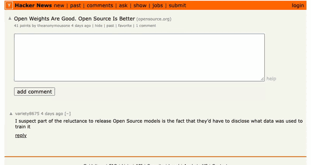

<div align="center">

# 翻译助手

**在输入框里用中文打草稿，译文原地整段替回 —— 不用 API Key、不上传文本、装好语言包离线也能用**

*Write-back translation for Chrome: draft in your own language, the translation replaces it in place — plus offline bilingual page reading. No API keys, no uploads, no tracking.*

**简体中文** | [English README](README.en.md)

[](LICENSE)
[](https://www.google.com/chrome/)
[](https://github.com/DreamOfXM/translate-assistant/pulls)



*中文直接打在评论框里 → 点框边的「翻译回复」→ 译文卡片就地弹出 → 点「填入输入框」整段替回，发送键仍然在你手上*

</div>

---

## ✨ 它能做什么

| | 能力 | 说明 |
| --- | --- | --- |
| ✍️ | **写入式翻译** | 评论框里用中文打草稿，译文**整段替回**输入框；**确认后**才写入，绝不替你发送 |
| 📖 | **整页双语对照** | 打开外文网页，译文自动逐段插在原文下方；只翻正文，导航/广告/评论区一律不碰 |
| 🔍 | **选中即译** | 随便选一段外文，点「翻译选中」，结果卡片就地弹出 |
| ⚡ | **两个引擎，自动择优** | 浏览器已内置对应语言模型时优先用它（Chrome 138+），否则用扩展自带的离线引擎 |
| 📴 | **离线可用** | 语言包下载一次后，断网照常翻译 |
| 🔒 | **隐私优先** | 文本、草稿、译文都不上传，两套引擎都在设备上完成翻译；网络只用于下载模型 |

<p align="center">
  
  
  
</p>

## ✍️ 写入式翻译：用中文写，译文原地替回输入框

读别人写的网页要翻译，自己写回复更要翻译。这个能力做的是**最后一步**：
在评论框、发帖框、网页版邮箱的正文框里直接用中文打草稿，点框边的「翻译回复」，译文卡片就地弹出；点「填入输入框」，整段替成译文——发送键仍然在你手上。

难点不在翻译，在写入。往输入框里写字看起来是一行赋值，实际是这类产品翻车最多的地方，所以我们把写入做成了**必须验真**：

- **只认「整段替换」**：写完复核框里内容是否逐字等于译文。追加在原文后面、留下半中半英的草稿，一律判失败
- **三条通道挨个试，试坏就回滚**：`execCommand` 插入 → 原生全选再插入 → 模拟粘贴事件。Reddit（Lexical）这类编辑器挡掉前两条却接受粘贴；写坏了就撤销回原样，每撤一次复核一次，宁可什么都不改
- **React 受控输入框也认**：绕过框架的 value setter 再补发 `input` / `change`，否则界面上填好了、框架里的状态还是空的，点发送就是一封空帖
- **iframe 里的正文框照样能写**：网页版邮箱的写信框大多关在 iframe 里
- **草稿不出设备**：两套引擎都在本地跑，敏感的是草稿而不是你打开的那篇网页

> 少数富文本编辑器把所有程序化写入都堵死。这时译文会自动放进剪贴板，面板明说「这个编辑器不接受自动填入」并让你全选后粘贴——不会假装成功。
> 桌面 App（邮件客户端、聊天软件、备忘录）里的输入框浏览器扩展够不着——macOS 上由下面的[菜单栏版](macos/README.md)接手，走系统辅助功能 API，同一套引擎。

## 🌐 翻译引擎：两套都跑在你的设备上

扩展内置两套引擎，自动挑当下更合适的那个 —— 用哪套都**不上传文本**。

| | 引擎 | 什么时候用 |
| --- | --- | --- |
| ⚡ | **Chrome 内建翻译**<br>（需 Chrome 138+） | 浏览器里已有该语言方向的端上模型时优先使用。模型由 Chrome 自行下载和管理；按 Chrome 官方说明，使用模型时不向 Google 或第三方发送数据 |
| 📦 | **本地语言包**<br>[bergamot-translator](https://github.com/browsermt/bergamot-translator)（Firefox 翻译同款，MPL-2.0） | 上面那条不可用时兜底；断网、内网、飞行模式也靠它 |

> Chrome 内建模型的下载由浏览器把关：只有你点了「翻译」才会触发，扩展不会在你不点的情况下悄悄下模型。
> 模型还没就绪时，这一次先用本地语言包翻出来，模型在后台继续下载，之后的段落自然切过去。

## 📥 语言包：下载一次，离线终生

模型来自 Mozilla 的公开 [Firefox Translations](https://github.com/mozilla/firefox-translations-models) 模型库（116 个方向，MPL-2.0）。

<p align="center">
  
</p>

- **按需下载**：第一次使用某个语言方向时才下载对应语言包（单个 13–60 MB，多数在 30 MB 上下），下载前会明确告诉你体积
- **离线运行**：装好之后翻译完全本地完成，断网、内网、飞行模式都能用
- **完整性校验**：模型文件带 SHA-256 校验，损坏自动丢弃重下
- **非英语对经英语中转**：Mozilla 只发布「各语言 ↔ 英语」模型，中文 ↔ 日语这类方向会自动经英语中转（界面会注明需要两个语言包）

## 📦 安装

### 方式一：直接下载（推荐）

1. 到 [Releases](https://github.com/DreamOfXM/translate-assistant/releases) 下载最新的 `translate-assistant-vX.Y.Z.zip`
2. 解压到任意目录
3. 打开 `chrome://extensions` → 开启右上角「开发者模式」→ 点「加载已解压的扩展程序」→ 选择解压出的 `translate-assistant` 文件夹
4. 刷新已经打开的网页（content script 只注入新加载的页面）

> 未打包上架商店的扩展需要开发者模式加载；扩展不含任何遥测，介意的话可以审查源码。

### 方式二：从源码构建（开发者）

要求 Chrome 109+（用到离屏文档 API）、Node.js 18+。

```bash
npm install
npm run build
```

构建产物在 `dist/translate-assistant`（同上方式加载），同时生成可分发的 `dist/translate-assistant-v版本.zip`。

> ⚠️ 必须加载 `dist/` 而不是 `extension/`：`content.js` 需经 esbuild 打包成单文件经典脚本。

## 🚀 快速开始

1. **装语言包**：点扩展图标 → 「语言包管理」→ 下载你需要的方向（如 英语→中文）
2. **读外文网页**：直接打开，译文自动出现；点右下角按钮可整页收起/展开
3. **写外文回复**：在评论框或网页版邮箱的写信框点「翻译回复」，用中文写草稿 → 生成译文 → 确认填入

界面支持 **中文 / English**，默认跟随浏览器语言，欢迎页与「语言包管理」页均可切换。

## 🖥️ macOS 菜单栏版

> 这一节只与 macOS 用户有关，Windows / Linux 用户可以跳过 —— 扩展本身不依赖任何平台特性。

浏览器扩展只能看见浏览器里的网页。想在同一套引擎下翻译**任何 App 的输入框**
（备忘录、邮件客户端、聊天工具……），仓库里还有一个 macOS 菜单栏应用。

```bash
npm run build:macos
open macos/dist/TranslateAssistant.app
```

- 快捷键 `⌃⌥T` 翻译当前输入框、`⌃⌥Y` 翻译选中文字，浮层确认后原地填回
- 复用**同一份** Bergamot WASM 引擎与同一批语言包，完全离线
- 走系统辅助功能 API 读写焦点输入框，因此需要一次「辅助功能」授权
- 菜单里的「在 App 里翻译浏览器当前页面」：不装扩展，在 App 自己的窗口里做整页双语。
  它只向浏览器要当前标签页的**地址**，正文由这个窗口重新加载，要的是「自动化」授权而不是「辅助功能」
- 浮层刻意做成不抢焦点，填回前自动把焦点还给目标 App

覆盖范围、授权步骤与已知盲区见 [macos/README.md](macos/README.md)。

## ⚠️ 已知限制

- 模型以英语为中心：中文 ↔ 非英语语言需经英语中转，速度与质量略降
- Chrome 内建引擎只在 Chrome 138+ 上可用，支持哪些语言方向由 Chrome 决定，而且不能预装到离线环境——不可用时自动回落到本地语言包，功能不受影响
- WASM 运行时约 5 MB，加载语言包后内存占用会明显上升（换取第二次翻译免冷启动）
- 语言识别与正文识别均为轻量启发式，个别特殊页面可能误判（宁可多翻，不漏翻）
- 部分富文本编辑器不接受程序化填入，此时面板会提示改用复制
- 只作用于浏览器里的网页。桌面客户端（各种邮箱大师、聊天软件、笔记软件）里的输入框不属于扩展能触及的范围，网页版邮箱（邮件正文框在 iframe 里也支持）则可以正常使用。这类输入框在 macOS 上可以用仓库里的 [macOS 菜单栏版](macos/README.md)（仅 macOS），它走系统辅助功能 API，与浏览器无关

## 🛠️ 发版 / 贡献

```bash
npm run release             # 补丁版 1.1.0 → 1.1.1：测试 → 构建 → tag → 双语 Release 一条龙
npm run release -- minor    # 次版本 1.1.0 → 1.2.0
RELEASE_NOTES_ZH="..." RELEASE_NOTES_EN="..." npm run release   # 自定义 Release 说明
DRY_RUN=1 npm run release   # 演练：只构建不推送
```

需要已登录的 `gh` CLI。日常开发请先跑 `npm test` 与 `npm run test:e2e`。

## 🧭 项目结构

```text
extension/
  manifest.json       MV3 清单（最小权限：storage / contextMenus / offscreen）
  background.js       Service Worker：消息路由 + 离屏文档生命周期
  offscreen.html/js   离屏文档：WASM 翻译引擎宿主
  content.js          页面交互：选中翻译 / 回复面板 / 整页双语 / 悬停翻译
  lib/                可复用模块（i18n / 语言 / 文本 / 引擎桥 / 正文提取…）
  ui/                 popup、语言包管理页、欢迎页
  icons/              中英两套工具栏图标（源文件为 icon*-src.svg）
  _locales/           清单里名称与描述的多语言包（中文 / English）
  vendor/             bergamot-translator 0.4.9（MPL-2.0）
tests/unit/           单元测试（node:test + jsdom）
tests/e2e/            Playwright 端到端冒烟测试
macos/                macOS 菜单栏应用（辅助功能 API 读写任意输入框，复用同一引擎；
                      另有一个 App 内页面窗口，不装扩展也能整页双语）
scripts/              打包与引擎验证脚本
docs/                 商店文案与演示素材
LICENSE               MPL-2.0 许可证全文
```

## 📄 许可证

[MPL-2.0](LICENSE)。翻译运行时与语言模型分别遵循其上游许可证（见「语言包」一节）。
